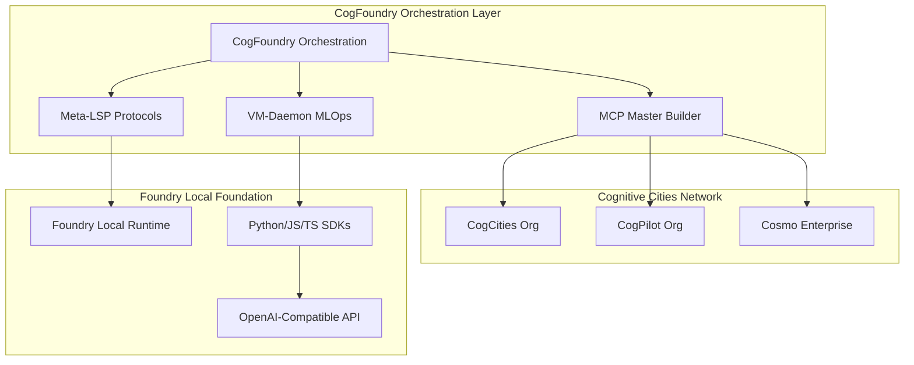

<div align="center">
  <picture align="center">
    <source media="(prefers-color-scheme: dark)" srcset="media/icons/ai_studio_icon_white.svg">
    <source media="(prefers-color-scheme: light)" srcset="media/icons/ai_studio_icon_black.svg">
    
  </picture>
<div id="user-content-toc">
  <ul align="center" style="list-style: none;">
    <summary>
      <h1>CogFoundry Orchestration Engine</h1><br>
      <h2>Principal Architect of the Cognitive Cities Ecosystem</h2><br>
     <h3><a href="https://aka.ms/foundry-local-installer">Download</a> | <a href="./cogfoundry-orchestration/README.md">CogFoundry Docs</a> | <a href="https://aka.ms/foundry-local-discord">Discord</a></h3>
    </summary>
  </ul>
</div>
</div>

## 🏗️ Welcome to CogFoundry

**The Evolution of Foundry Local into a Cognitive Cities Orchestration Engine**

CogFoundry transforms the power of local AI into a distributed cognitive architecture, enabling the deployment of AI Neural Architectures across Networks of Cognitive Cities. Built upon Foundry Local's foundation, CogFoundry adds:

- **Cognitive Cities Integration**: Coordinate AI development across GitHub organizations
- **Neural Transport Protocols**: High-bandwidth communication between cognitive cities  
- **MCP Master Builder**: Custom protocols enabling CogPilot cognitive development
- **Meta-LSP Extensions**: Introspective development with self-designing systems
- **Distributed AGI Evolution**: Systematic progression toward Autognosis & Autogenesis

## 🧠 Cognitive Architecture



## 🚀 CogFoundry Quickstart

### Traditional Foundry Local Usage

CogFoundry maintains full backward compatibility with Foundry Local:

1. **Install Foundry Local:**
    - **Windows**: Install Foundry Local for your architecture (x64 or arm64):

- Run Generative AI models directly on your local hardware - no sign-up required.
- Keep all data processing on-device for enhanced privacy and security
- Integrate models with your applications through an OpenAI-compatible API
- Optimize performance using ONNX Runtime and hardware acceleration

### CogFoundry Orchestration Usage

For cognitive cities development and distributed AI orchestration:

1. **Initialize CogFoundry Orchestration:**
   ```bash
   cd cogfoundry-orchestration
   python orchestration-engine.py
   ```

2. **Generate Domain-Specific Kernels:**
   ```python
   from universal_kernel_generator import UniversalKernelGenerator
   
   generator = UniversalKernelGenerator()
   kernel = generator.generate_computing_kernel(order=4)
   print(f"Grip: {kernel.grip_metric:.4f}")
   ```

3. **Evolve Self-Optimizing Kernels:**
   ```python
   from ontogenesis import EvolutionEngine, DomainType
   
   engine = EvolutionEngine(population_size=20, domain=DomainType.COMPUTING)
   engine.initialize_population()
   history = engine.run_evolution(max_generations=30)
   best = engine.get_best_kernel()
   ```

4. **Orchestrate Cognitive Cities Deployment:**
   ```python
   from orchestration_engine import CogFoundryOrchestrationEngine
   
   orchestrator = CogFoundryOrchestrationEngine()
   await orchestrator.initialize()
   
   # Deploy AI architecture across cognitive cities
   await orchestrator.orchestrate_deployment({
       "name": "distributed_neural_network",
       "target_cities": ["cogcities", "cogpilot", "cosmo"]
   })
   
   # Deploy evolved computational kernels
   await orchestrator.orchestrate_kernel_deployment(
       domain="computing",
       target_cities=["cogcities", "cogpilot"]
   )
   ```

5. **Run Complete Examples:**
   ```bash
   cd cogfoundry-orchestration/examples
   python3 python_sdk_example.py
   ```

📚 **See [Getting Started Guide](./cogfoundry-orchestration/GETTING_STARTED.md) for comprehensive documentation.**

## 🚀 Traditional Foundry Local Quickstart

1. **Install Foundry Local:**
    - **Windows**: Install Foundry Local for your architecture (x64 or arm64):
   
      ```bash
        winget install Microsoft.FoundryLocal
        ```
      
    - **MacOS**: Open a terminal and run the following command:
        ```bash
        brew tap microsoft/foundrylocal
        brew install foundrylocal
        ```
Alternatively, you can download the installers from the [releases page](https://github.com/microsoft/Foundry-Local/releases) and follow the on-screen installation instructions.

> [!TIP]
> For any issues, refer to the [Installation section](#installing) below.

2. **Run your first model**: Open a terminal and run the following command to run a model:

   ```bash
   foundry model run phi-3.5-mini
   ```

> [!NOTE]
> The `foundry model run <model>` command will automatically download the model if it's not already cached on your local machine, and then start an interactive chat session with the model.

Foundry Local will automatically select and download a model *variant* with the best performance for your hardware. For example:

- if you have an Nvidia CUDA GPU, it will download the CUDA-optimized model.
- if you have a Qualcomm NPU, it will download the NPU-optimized model.
- if you don't have a GPU or NPU, Foundry local will download the CPU-optimized model.

### 🔍 Explore available models

You can list all available models by running the following command:

```bash
foundry model ls
```

This will show you a list of all models that can be run locally, including their names, sizes, and other details.

## 🧑‍💻 Integrate with your applications using the SDK

Foundry Local has an easy-to-use SDK (Python, JavaScript) to get you started with existing applications:

### Python

The Python SDK is available as a package on PyPI. You can install it using pip:

```bash
pip install foundry-local-sdk
pip install openai
```

> [!TIP]
> We recommend using a virtual environment such as `conda` or `venv` to avoid conflicts with other packages.


Foundry Local provides an OpenAI-compatible API that you can call from any application:

```python
import openai
from foundry_local import FoundryLocalManager

# By using an alias, the most suitable model will be downloaded 
# to your end-user's device.
alias = "phi-3.5-mini"

# Create a FoundryLocalManager instance. This will start the Foundry 
# Local service if it is not already running and load the specified model.
manager = FoundryLocalManager(alias)

# The remaining code us es the OpenAI Python SDK to interact with the local model.

# Configure the client to use the local Foundry service
client = openai.OpenAI(
    base_url=manager.endpoint,
    api_key=manager.api_key  # API key is not required for local usage
)

# Set the model to use and generate a streaming response
stream = client.chat.completions.create(
    model=manager.get_model_info(alias).id,
    messages=[{"role": "user", "content": "What is the golden ratio?"}],
    stream=True
)

# Print the streaming response
for chunk in stream:
    if chunk.choices[0].delta.content is not None:
        print(chunk.choices[0].delta.content, end="", flush=True)
```

### JavaScript

The JavaScript SDK is available as a package on npm. You can install it using npm:

```bash
npm install foundry-local-sdk
npm install openai
```

```javascript
import { OpenAI } from "openai";
import { FoundryLocalManager } from "foundry-local-sdk";

// By using an alias, the most suitable model will be downloaded 
// to your end-user's device.
// TIP: You can find a list of available models by running the 
// following command in your terminal: `foundry model list`.
const alias = "phi-3.5-mini";

// Create a FoundryLocalManager instance. This will start the Foundry 
// Local service if it is not already running.
const foundryLocalManager = new FoundryLocalManager()

// Initialize the manager with a model. This will download the model 
// if it is not already present on the user's device.
const modelInfo = await foundryLocalManager.init(alias)
console.log("Model Info:", modelInfo)

const openai = new OpenAI({
  baseURL: foundryLocalManager.endpoint,
  apiKey: foundryLocalManager.apiKey,
});

async function streamCompletion() {
    const stream = await openai.chat.completions.create({
      model: modelInfo.id,
      messages: [{ role: "user", content: "What is the golden ratio?" }],
      stream: true,
    });
  
    for await (const chunk of stream) {
      if (chunk.choices[0]?.delta?.content) {
        process.stdout.write(chunk.choices[0].delta.content);
      }
    }
}
  
streamCompletion();
```

## Manage

This section provides an overview of how to manage Foundry Local, including installation, upgrading, and removing the application.

### Installing

Foundry Local is available for Windows and macOS (Apple silicon only). You can install it using package managers or manually download the installer.

#### Windows

You can install Foundry Local using the following command in a Windows console (PowerShell, cmd, etc.):

```bash
winget install Microsoft.FoundryLocal
```

Alternatively, you can also manually download and install the packages. On [the releases page](https://github.com/microsoft/Foundry-Local/releases)
select a release and expand the Artifacts list. Copy the artifact full URI (for example: `https://github.com/microsoft/Foundry-Local/releases/download/v0.3.9267/FoundryLocal-x64-0.3.9267.43123.msix`)
to use in the below PowerShell steps. Replace `x64` with `arm64` as needed.

```powershell
# Download the package and its dependency
$releaseUri = "https://github.com/microsoft/Foundry-Local/releases/download/v0.3.9267/FoundryLocal-x64-0.3.9267.43123.msix"
Invoke-WebRequest -Method Get -Uri $releaseUri -OutFile .\FoundryLocal.msix
$crtUri = "https://aka.ms/Microsoft.VCLibs.x64.14.00.Desktop.appx"
Invoke-WebRequest -Method Get -Uri $crtUri -OutFile .\VcLibs.appx

# Install the Foundry Local package
Add-AppxPackage .\FoundryLocal.msix -DependencyPath .\VcLibs.appx
```

If you're having problems installing Foundry, please [file an issue](https://github.com/microsoft/foundry-local/issues)
and include logs using one of these methods:

* For WinGet - use `winget install Microsoft.FoundryLocal --logs --verbose` - select the most-recently-dated log file
  and attach it to the issue.
* For `Add-AppxPackage` - immediately after it indicates an error, in an elevated PowerShell instance, use
  `Get-MsixLogs | Out-File MsixLogs.txt` and attach it to the issue.
* Use [Windows Feedback Hub](feedback-hub:) and create a Problem in the "Apps > All other apps" category. Use the
  "Add More Details > Recreate my problem" and re-run the failing commands to collect more data. Once your feedback
  is submitted, use the "Share" option to generate a link and put that into the filed issue.

> [!NOTE]
> Log files may contain information like user names, IP addresses, file paths, etc. Be sure to remove those
> before sharing here.

#### macOS

Install Foundry Local using the following commands in your terminal:

```bash
brew tap microsoft/foundrylocal
brew install foundrylocal
```

Alternatively, you can also manually download and install the packages by following these steps:

1. Download the latest release from [the releases page](https://github.com/microsoft/Foundry-Local/releases).
1. Unzip the downloaded file.
1. Open a terminal and navigate to the unzipped folder, run the following command to install Foundry Local:

   ```bash
   ./install-foundry.command
   ```

### Upgrading

To upgrade Foundry Local, run the following command in your terminal:

- **Windows**
  ```bash
  winget upgrade --id Microsoft.FoundryLocal
  ```

- **macOS**:
  If you installed Foundry Local using Homebrew, you can upgrade it with the following command:
  ```
  brew upgrade foundrylocal
  ```
  If you installed Foundry Local manually, you'll first need to uninstall the current version using:
  ```bash
  uninstall-foundry
  ```
  Then, follow the [installation instructions](#installing) to install the latest version.

### Uninstalling
To uninstall Foundry Local, run the following command in your terminal:

- **Windows**: You can uninstall Foundry Local using `winget` in a Windows console (PowerShell, cmd, etc.):
  ```bash
  winget uninstall Microsoft.FoundryLocal
  ```
  Alternatively, you can also uninstall Foundry Local by navigating to **Settings > Apps > Apps & features** in Windows, finding "Foundry Local" in the list, and selecting the ellipsis (`...`) followed by **Uninstall**.

- **macOS**: If you installed Foundry Local using Homebrew, you can uninstall it with the following command:
  ```bash
  brew rm foundrylocal
  brew untap microsoft/foundrylocal
  brew cleanup --scrub
  ```
  If you installed Foundry Local manually, you can uninstall it by running the following command in your terminal:
  ```bash
  uninstall-foundry
  ```

## Features & Use Cases

- **On-device inference** - Process sensitive data locally for privacy, reduced latency, and no cloud costs
- **OpenAI-compatible API** - Seamlessly integrate with applications using familiar SDKs
- **High performance** - Optimized execution with ONNX Runtime and hardware acceleration
- **Flexible deployment** - Ideal for edge computing scenarios with limited connectivity
- **Development friendly** - Perfect for prototyping AI features before production deployment
- **Model versatility** - Use pre-compiled models or [convert your own](./docs/how-to/compile-models-for-foundry-local.md).

## Reporting Issues

We're actively looking for feedback during this preview phase. Please report issues or suggest improvements in the [GitHub Issues](https://github.com/microsoft/Foundry-Local/issues) section.

## 🎓 Learn

- [Detailed documentation](./docs/README.md)
- [CLI reference](./docs/reference/reference-cli.md)
- [REST API reference](./docs/reference/reference-rest.md)
- [Security and privacy](./docs/reference/reference-security-privacy.md)
- [Troubleshooting guide](./docs/reference/reference-troubleshooting.md)

## ⚖️ License

Foundry Local is licensed under the Microsoft Software License Terms. For more details, read the [LICENSE](LICENSE) file.
